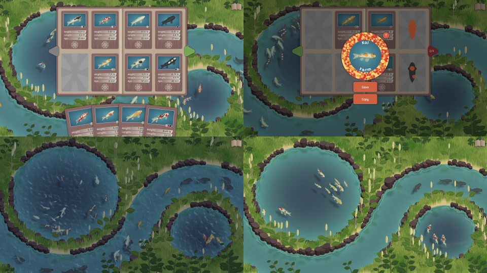

# Koi Farm

A Koi breeding game. Get it [on steam](https://store.steampowered.com/app/1518810/Koi_Farm) or [on itch.io](https://jobtalle.itch.io/koifarm).

## Building

HTML, CSS and Javascript content is compressed using [squish.py](https://github.com/jobtalle/squish.py), which is included in this repository as a submodule. Before building, ensure that this library has been cloned as well.

Make sure [node.js](https://www.nodejs.org) and [python 3](https://www.python.org/) are installed. After calling `npm i` to install all required packages, the following commands can be used to create binaries using [electron](https://github.com/electron/electron):

| Operating system | Command |
| --- | --- |
| Windows (32 bit) | `npm run build-win-32` |
| Windows (64 bit) | `npm run build-win-64` |
| Linux (64 bit) | `npm run build-linux-64` |
| Mac (64 bit) | `npm run build-mac-64` |

Additionally, `npm run compress` can be called to compress HTML, CSS and Javscript content without building binaries. The compressed HTML file `release.html` will be created in the project root. The file requires the `audio`, `font`, `svg` and `language` directories to run, as well as `favicon.ico` and `manifest.json`.

## Translations

The game is available in several languages. Translations can be found in [this repository](https://github.com/jobtalle/KoiTranslations), and new translations can be proposed there; when new translations are made, I will add them to the game.

## Contributing

Contributions can be proposed by submitting pull requests. The best place to ask questions is in [the official discord](https://discord.gg/bw3ZFe63Qg), which has a dedicated channel for source code related discussions.

## License

Koi Farm is distributed under the [Apache 2.0 with Commons Clause](LICENSE.md) license.
